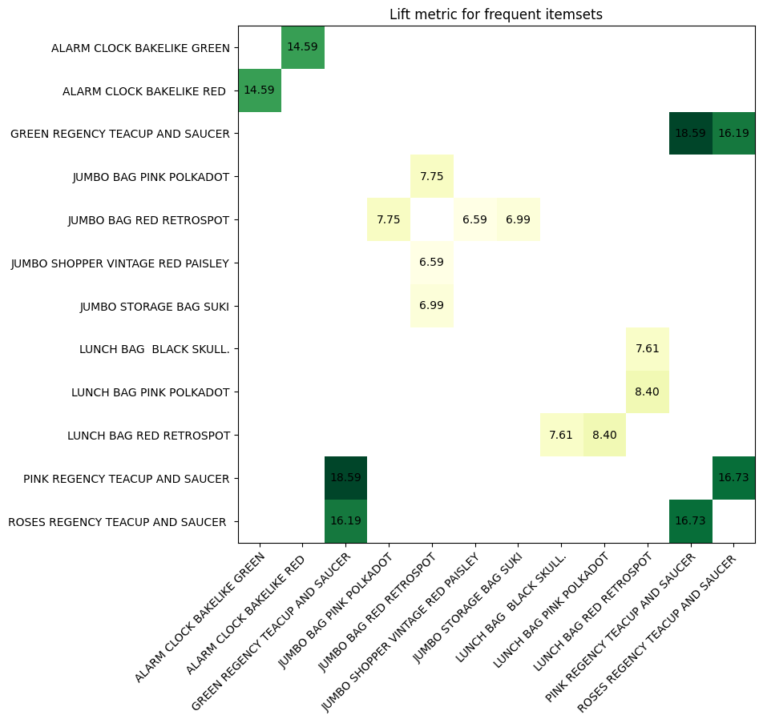

# Online Retail Market Basket Analysis with Apriori
Association Rule Mining with Apriori in Python

## Project Overview

For this project, I am demonstrating my understanding of the Apriori algorithm by applying it to a Online Retail dataset. The aim was to perform exploratory data analysis and discover meaningful association rules that highlight relationships within the data. This analysis included:

* Process and prepare real-world data.  
* Implement the Apriori algorithm and utilize a library effectively.  
* Interpret the results of association rule mining.
* Present valuable insights to draw a change.

## Dataset Description

The dataset used in this analysis comes from UC Irvine Machine Learning Repository. Following description on the page, this is a transaction dataset containing all transactions that took place between 01/12/2010 and 09/12/2011 for a UK-based and registered non-store online retailer.

* **Dataset Source:** Chen, D. (2015). Online Retail \[Dataset\]. UCI Machine Learning Repository. https://archive.ics.uci.edu/dataset/352/online+retail  
* **Dataset Size:** There have been 24,446 transactions with 4223 unique items.   
* **Data Characteristics:** The data is in .xlsx format. There are no missing values. The only preliminary processing required was to ensure that the 'Description' column was formatted as a string. This was necessary to ensure that the data could be fully evaluated during the analysis.

## Analysis Objectives

The primary objectives of this analysis were to:

1. **Identify frequent itemsets:** Determine which combinations of items occur frequently within the dataset.  
2. **Generate association rules:** Discover rules that describe relationships between items (e.g., "If a customer buys X, they are also likely to buy Y").  
3. **Evaluate rules:** Assess the significance of the generated rules using metrics such as support, confidence, and lift.  
4. **Extract actionable insights:** Obtain meaningful conclusions from the analysis that could be relevant to a business.

## Key Findings and Insights

To complete the analysis of frequent itemsets, a lift heatmap was generated. This visualisation effectively highlights the strength of association rules through colour intensity, allowing for the immediate identification of item combinations with the highest Lift values. A high lift value indicates a strong positive relationship, meaning that the items are significantly more likely to be purchased together than independently.

For example, the observed lift of 7.75 between 'JUMBO BAG PINK POLKADOT' and 'JUMBO BAG RED RETROSPOT' suggests a strong positive relationship. Specifically, customers who purchase 'JUMBO BAG PINK POLKADOT' are 675% more likely to also purchase 'JUMBO BAG RED RETROSPOT' compared to the expectation if the purchases were independent.

It's also important to note that some frequent items exhibit relationships with multiple consequent items. For instance, 'JUMBO BAG RED RETROSPOT' shows strong associations with several other products. This interconnectedness signifies a high potential for cross-selling strategies involving these items.

Furthermore, the generated association rules were applied to inform product discounting decisions. To maximize customer satisfaction, nine individual items were selected for discounting, with the goal of representing one key item from each significant product grouping identified through the analysis.

## Further Exploration

I would like to extend this analysis by:

* Exploring the impact of varying minimum support and confidence thresholds on the results.  
* Perform the FP-Growth algorithm to cross-validate the results.  
* Presenting a comprehensive report detailing the methodologies and key findings, supported by detailed visualizations and tables that include relevant metrics.
